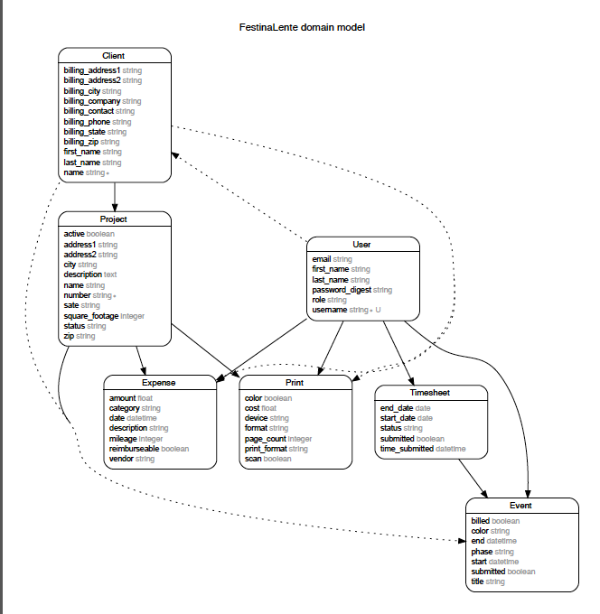

readme.md

## FESTINA LENTE
Festina Lente is a time tracking and billing system tailored to the needs
of a boutique architectural studio. Festina Lente is built on the premise that
the tool should work for the user, not impose a workflow. "Festina lente" is the
Swift family motto, meaning "Make haste, carefully." This adage speaks to the
value of thoughtful, yet efficient work.

There are two types of users: architects and administrators. The architects
simply add time entries via familiar calendar interface. The app also captures
client billing for prints, scans, and other reimbursable expenses.

Administrators can add clients, projects, billing contacts. The end product will
enable admins to view reports, generate invoices, and track key performance
indices.

### Technology
#### Front End
The calendar interface is powered by FullCalendar.JS, using Moment.js, and
DateRangePicker.js for support. The program utilizes the Bootstrap framework, as
well as GoogleFonts, and FontAwesome.
#### Back End
The program is built in Ruby, on the Rails framework. Authentication is handled
through BCrypt. Data persists in a PostgreSQL database. Rails uses JBuilder to
generate JSON objects.
#### Testing & Deployment
TravisCI deploys to Heroku. Testing is handled using Minitest and Capybara. This
is the first project where I have explored RsÂ=pec.

### To Do
* billing
* time sheet submittal
* invoicing

### Screenshots

